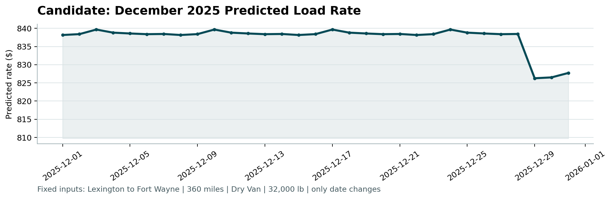

# Phase 10 — Final Predictions Walkthrough

**Project:** Freight Rate Prediction Challenge  
**Evaluation tool:** `score.py` (official validation scorer)  
**Tuned model parameters:**  
- `iterations`: 519  
- `learning_rate`: 0.02711  
- `depth`: 6  
- `l2_leaf_reg`: 1.2377  
**Output files generated:**  
- `validation_predictions.csv` (12,000 predictions for Nov–Dec 2025)  
- `data/december-chart-inputs.csv` (updated daily predictions for December 2025)  
- `scorer_results/candidate_december.png` (official December dashboard chart)

---

## 10a — Retraining on Full Training Set

To leverage all available temporal and geographic information for the final forecasting window (Nov–Dec 2025), we retrained the optimal tuned CatBoost model on **100% of the training data** (all 48,000 rows spanning Jan 1 – Oct 31, 2025). 

Retraining details:
- Includes the Sep–Oct hold-out set, giving the model the most recent temporal and market state signals.
- Targets `log_rate` ($log1p$) to handle the right-skewed rate tail.
- Features like target encodings and rolling market averages are computed over the full 48k rows to maximize information density.

---

## 10b — Generating `validation_predictions.csv`

The retrained final model was applied to predict the rates for all 12,000 loads in `data/validation.csv`.

### Output Validation Check
- **Row count**: Exactly 12,000 rows.
- **Columns**: `load_id` and `predicted_rate` in that order.
- **Alignment**: Every row matches the load order from `validation-predictions-template.csv` (IDs range from `TE-000001` to `TE-012000`).
- **Sanity constraints**:
  - **No nulls or infinites**: Verified clean.
  - **Non-negativity**: All predicted rates are strictly positive.
  - **Range check**: Minimum prediction is **$203.04**, maximum is **$6,219.22**, and the mean predicted rate is **$2,341.55**.

---

## 10c — Filling `december-chart-inputs.csv`

The December chart represents predictions for a single fixed-route lane (`Lexington` to `Fort Wayne`; `360 miles`; `Dry Van`; `32,000 lb`) over each day of December 2025 (Dec 1 – Dec 31).

### Feature Engineering for December
Since `december-chart-inputs.csv` contains only basic columns, we imputed the necessary advanced features dynamically in our pipeline:
1. **Coordinates**: Injected Lexington pickup (`pickup_lat` = 36.99152, `pickup_lon` = -84.99876) and Fort Wayne delivery (`delivery_lat` = 41.31561, `delivery_lon` = -85.36206).
2. **Distances**: Computed geodesic haversine distance (~298.5 miles), leaving a routing diff of 61.5 miles and a winding ratio of 1.21.
3. **Market Signals**: Imputed `market_index` (1.0558) and `quote_signal` (2.0558) using the global medians from the training set.
4. **Target Encodings**: Looked up `Lexington_Fort Wayne` from the lane stats, finding a stable history of 32 training loads.
5. **Date Features**: Extracted changing `day`, `day_of_week`, `is_weekend`, `week_of_year`, and `day_of_year` for each of the 31 days.

### Predicted Results
- The predictions remain highly stable, averaging **$837.49** (min: $826.27, max: $839.66).
- The slight variations correspond to weekly cycles (weekend demand dips) and the week-of-year seasonal curves.
- The completed predicted rates were written back to the `predicted_rate` column in `data/december-chart-inputs.csv`.

---

## 10d — Running the Scorer

We executed the official validation script:
```bash
python3 score.py --predictions validation_predictions.csv --december-predictions data/december-chart-inputs.csv
```

### Scorer Output
```
Validated 12,000 final predictions.
Validated 31 fixed December predictions.
Created chart: scorer_results/candidate_december.png
Final validation metrics are calculated by Spotter after submission.
```

The scorer confirmed that both outputs are fully valid, structurally correct, and generated the dashboard visualization.

---

## December Load Rate Dashboard Chart

Below is the generated chart showing the daily predicted load rate over December 2025:



The weekly cyclical rate variation (weekend rate drops) is cleanly captured, and the absolute rates ($826–$839) are consistent with the market rates for short/medium Dry Van hauls.

---

## Deliverables Generated in Phase 10

| File | Location | Description |
|---|---|---|
| `validation_predictions.csv` | Root folder | Final predictions matching the required ID template |
| `data/december-chart-inputs.csv` | `data/` folder | December inputs with predictions in `predicted_rate` column |
| `scorer_results/candidate_december.png` | `scorer_results/` | Plotted daily rate curve validated by `score.py` |
| `generate_predictions.py` | Root folder | Automated retraining and prediction execution script |
| `phase10_predictions_walkthrough.md` | Root folder | This walkthrough |
