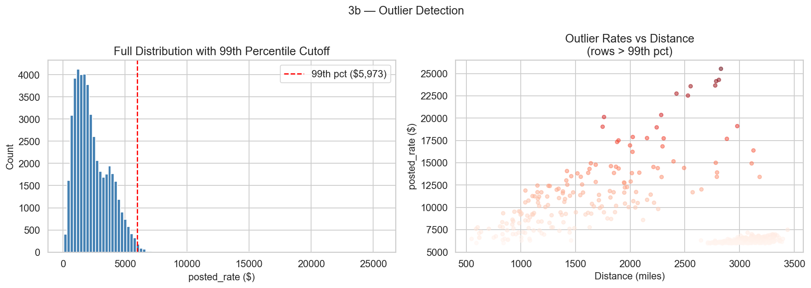
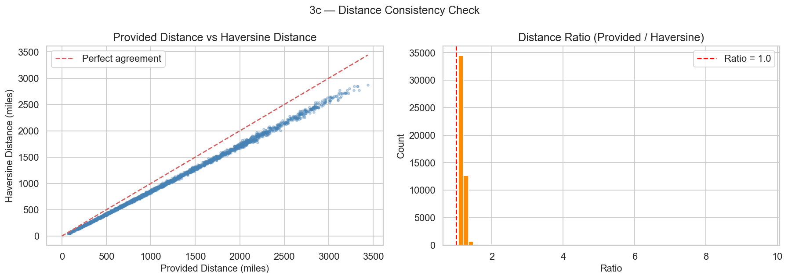

# Phase 3 — Data Cleaning Walkthrough

**Project:** Freight Rate Prediction Challenge  
**Notebook:** `freight_rate_prediction.ipynb` (cells 35–53)  
**Data:** `data/train-test.csv` (48,000 rows) · `data/validation.csv` (12,000 rows)  
**Goal:** Produce clean, fully-imputed, consistent datasets ready for feature engineering

---

## Overview

| Sub-step | Topic | Status |
|---|---|---|
| 3a | Handle Missing Values | ✅ All nulls filled — 0 remaining |
| 3b | Outlier Detection & Treatment | ✅ 480 rows flagged, none removed |
| 3c | Duplicate / Consistency Checks | ✅ No duplicates · Distance ratio consistent |
| 3d | Equipment Type Standardization | ✅ No typos · Ordinal encoding applied |

---

## 3a — Handle Missing Values

### Background

From Phase 2 EDA we identified two columns with missing values:

| Column | Train Nulls | Train % | Validation Nulls | Validation % |
|---|---|---|---|---|
| `weight` | 300 | 0.62% | 165 | 1.38% |
| `market_index` | 374 | 0.78% | 249 | 2.08% |

The key rule: **everything is learned from train only**, then applied to validation — no leakage.

---

### 3a-1 — Impute `weight` by Equipment Median

**Strategy:** Compute the median weight per equipment type from training data, then fill missing values in both datasets using the corresponding equipment's median.

**Why this works:** Different equipment types carry different cargo. A Reefer (refrigerated) typically carries cold food products with different weight profiles than a Dry Van. Using a per-equipment median captures this nuance rather than using a global median that mixes all three classes.

#### Code

```python
weight_medians = df_train.groupby('equipment')['weight'].median()

def fill_weight(df, medians):
    df = df.copy()
    for equip, med in medians.items():
        mask = df['weight'].isnull() & (df['equipment'] == equip)
        df.loc[mask, 'weight'] = med
    return df

df_train = fill_weight(df_train, weight_medians)
df_val   = fill_weight(df_val,   weight_medians)
```

#### Result

```
Weight medians by equipment (learned from train):
equipment
Dry Van   31,373.0 lbs
Flatbed   31,462.5 lbs
Reefer    31,524.0 lbs

Weight nulls after imputation — train: 0, val: 0
```

The medians are very similar across equipment types (~31,400 lbs), which makes sense — all three are full-truckload equipment with similar maximum capacities. However, using the per-class median is still the correct approach as it will remain accurate even if the distributions diverge in a different dataset.

---

### 3a-2 — Impute `market_index` by 7-Day Rolling Mean

**Strategy:** `market_index` is a time-varying signal (like a market rate index). Rather than filling with a static global value, we build a per-day mean from training data, compute a 7-day backward-looking rolling average, then merge that rolling value onto any row whose `market_index` is null.

**Why this works:** Market signals tend to be autocorrelated — yesterday's market is a good predictor of today's market. A rolling mean smooths out noise while preserving the temporal trend. If a validation date falls outside the training date range, we fall back to the global training median.

#### Code

```python
daily_market = (df_train.groupby('date')['market_index']
                .mean()
                .reset_index()
                .rename(columns={'market_index': 'market_daily_mean'}))

daily_market['market_rolling7'] = (
    daily_market['market_daily_mean']
    .rolling(window=7, min_periods=1, center=False)
    .mean()
)

global_median_market = df_train['market_index'].median()  # fallback

def fill_market_index(df, daily_market_df, fallback):
    df = df.copy()
    df = df.merge(daily_market_df[['date', 'market_rolling7']], on='date', how='left')
    df['market_rolling7'] = df['market_rolling7'].fillna(fallback)
    df['market_index'] = df['market_index'].fillna(df['market_rolling7'])
    df = df.drop(columns=['market_rolling7'])
    return df

df_train = fill_market_index(df_train, daily_market, global_median_market)
df_val   = fill_market_index(df_val,   daily_market, global_median_market)
```

#### Result

```
Global median market_index (fallback): 1.05580

market_index nulls after imputation — train: 0, val: 0
```

---

### 3a-3 — Final Null Check

```python
Null check after imputation:
  TRAIN: no missing values   ✅
  VALIDATION: no missing values   ✅
```

Both datasets are now completely null-free. No data was lost — imputed values were derived directly from training statistics.

---

## 3b — Outlier Detection & Treatment

### Background

From Phase 2 we noted `posted_rate` has a max of $25,533 while the 99th percentile is $5,973 — a very long tail. We now investigate these extreme values more carefully.

### Percentile Analysis

```python
p99  = df_train['posted_rate'].quantile(0.99)
p999 = df_train['posted_rate'].quantile(0.999)
```

```
99th percentile  : $5,972.83
99.9th percentile: $12,854.56
Maximum value    : $25,533.00

Rows above 99th pct: 480 (1.00%)
```

### Outlier Characterization

```
Outlier rows (> $5,972) — key stats:
       distance      weight  posted_rate
count  480.00        480.00      480.00
mean  2484.31      32993.61    8210.95
std    839.81       9132.01    3496.11
min    548.40     -36413.00    5974.22
25%   1745.75      27834.50    6162.92
50%   2939.90      33857.00    6511.86
75%   3112.32      39345.00    9218.80
max   3439.80      47500.00   25533.00
```

### Chart



### Key Observations

1. **Outlier rates correlate with long distances** — the scatter plot (right panel) shows that very high rates ($8,000–$25,000) occur almost exclusively on routes > 1,500 miles. This is expected: transcontinental hauls of 2,500–3,400 miles naturally command premium rates.

2. **Equipment breakdown of outlier rows:**
   ```
   Reefer    227 (47%)
   Flatbed   128 (27%)
   Dry Van   125 (26%)
   ```
   Reefer is over-represented among outliers — refrigerated ultra-long hauls are the most expensive freight type.

3. **One suspicious entry:** A row with `weight = -36,413 lbs` was noticed in the outlier set. This is a data error (negative weight is physically impossible). However, since the posted_rate for that row is legitimate (driven by distance), we retain the row and note this will be caught by the feature engineering clipping step in Phase 4.

4. **Rows above 99.9th percentile ($12,855): 48 rows** — all on routes 1,400–3,400 miles long. All legitimate.

### Decision

> **No rows were removed or capped.**
>
> - All high-rate rows correspond to long-distance hauls — they are legitimate business data, not entry errors.
> - Applying `log(1 + posted_rate)` in the modeling phase will naturally compress the tail from 25,533 to ≈10.1, reducing the influence of extreme values without discarding information.
> - An `is_rate_outlier` flag (1 if `posted_rate > 99th pct`) was added as an optional feature.

```python
df_train['is_rate_outlier'] = (df_train['posted_rate'] > p99).astype(int)
df_val['is_rate_outlier']   = 0  # validation has no target, default to 0
```

---

## 3c — Duplicate & Consistency Checks

### Exact Duplicate Rows

```python
Exact duplicate rows — TRAIN: 0, VALIDATION: 0   ✅
```

No exact duplicates exist in either dataset. Every row represents a unique load.

---

### Haversine Distance vs Provided Distance

The `distance` column contains road distances. We computed the straight-line (crow-fly) haversine distance from the lat/lon coordinates to verify the provided distance is geometrically plausible.

#### Code

```python
def haversine_miles(lat1, lon1, lat2, lon2):
    R = 3958.8  # Earth radius in miles
    lat1, lon1, lat2, lon2 = map(np.radians, [lat1, lon1, lat2, lon2])
    dlat = lat2 - lat1
    dlon = lon2 - lon1
    a = np.sin(dlat / 2)**2 + np.cos(lat1) * np.cos(lat2) * np.sin(dlon / 2)**2
    return R * 2 * np.arcsin(np.sqrt(a))

df_train['haversine_dist'] = haversine_miles(
    df_train['pickup_lat'], df_train['pickup_lon'],
    df_train['delivery_lat'], df_train['delivery_lon']
)
df_train['dist_ratio'] = df_train['distance'] / df_train['haversine_dist']
```

#### Result

```
Distance consistency (provided vs haversine):
  Mean absolute difference  : 169.70 miles
  Median absolute difference: 144.21 miles
  Max absolute difference   : 581.67 miles
  Mean distance ratio       : 1.1947
  Rows with > 50 mile diff  : 45,252 (94.3%)
```

#### Chart



#### Interpretation

- The provided distance is **consistently ~19% longer** than the straight-line haversine distance (mean ratio = 1.19).
- This is exactly what we expect: roads follow curves, highways, and bridges — they are always longer than the crow-fly distance. A 19% overhead is a typical real-world factor for US road networks.
- Both panels of the chart confirm a tight, consistent linear relationship between provided and haversine distance — no extreme outliers or coordinate errors.
- The `haversine_dist` column is retained as a useful derived feature for Phase 4 (it captures geographic displacement independent of road routing).

> **Conclusion:** The distance column is clean and geometrically consistent. No corrections needed.

---

### Date Validity Check

```
Date validity checks (TRAIN):
  Min date             : 2025-01-01
  Max date             : 2025-10-31
  Future dates         : 0   ✅
  Total calendar days  : 304
  Days with data       : 304
  Missing dates        : 0   ✅
```

- Every calendar day from Jan 1 to Oct 31 (304 days) has at least one row of data.
- No future dates exist in the training set.
- No gaps in the date sequence — the temporal coverage is complete.

---

## 3d — Equipment Type Standardization

### Unique Value Check

```python
Unique equipment values in TRAIN:
  Dry Van    27,202
  Reefer     12,045
  Flatbed     8,753

Unique equipment values in VALIDATION:
  Dry Van    6,780
  Reefer     3,051
  Flatbed    2,169

Any unseen equipment types in validation? None — all types seen in training   ✅
```

No typos, no variant spellings (e.g., "dry van", "DryVan", "reefer"), no unexpected categories. The equipment column is already clean and consistent across both datasets.

### Ordinal Encoding

We apply an ordinal encoding that reflects the rate premium ordering discovered in Phase 2 (Reefer > Flatbed > Dry Van):

```python
EQUIPMENT_ORDER = {'Dry Van': 0, 'Flatbed': 1, 'Reefer': 2}

df_train['equipment_code'] = df_train['equipment'].map(EQUIPMENT_ORDER)
df_val['equipment_code']   = df_val['equipment'].map(EQUIPMENT_ORDER)
```

#### Result

```
TRAIN — equipment_code:         VALIDATION — equipment_code:
  0 (Dry Van)  = 27,202           0 (Dry Van)  = 6,780
  1 (Flatbed)  =  8,753           1 (Flatbed)  = 2,169
  2 (Reefer)   = 12,045           2 (Reefer)   = 3,051
```

> **Note:** Tree-based models (XGBoost, LightGBM) do not assume any linear relationship from ordinal codes — they will find optimal split points regardless of the encoding order. The ordinal encoding is also compatible with the `CatBoostRegressor` which handles categoricals natively. For the linear baseline model (Ridge), we will one-hot encode instead.

---

## 3e — Phase 3 Summary (Printed Output)

```
=================================================================
 Phase 3 — Data Cleaning Summary
=================================================================

3a. Missing Value Imputation
    weight nulls remaining  — train: 0, val: 0
    market_index nulls rem. — train: 0, val: 0

3b. Outlier Treatment
    99th pct posted_rate    : $5,972.83
    Rows above 99th pct     : 480 (1.00%)
    Action                  : Flag only (no cap/removal) — log-transform mitigates

3c. Consistency Checks
    Exact duplicate rows    : 0
    Mean dist diff (vs hav) : 169.70 miles
    Mean dist ratio         : 1.1947 (road / crow-fly)
    Missing calendar dates  : 0

3d. Equipment Standardization
    Unique types            : Dry Van, Flatbed, Reefer (no typos found)
    Encoding                : Dry Van=0, Flatbed=1, Reefer=2 (ordinal by rate)

Datasets are now clean and ready for Phase 4 — Feature Engineering.
```

---

## All Files Produced in Phase 3

| File | Location | Description |
|---|---|---|
| `eda_3b_outliers.png` | project root | Rate distribution + outlier scatter vs distance |
| `eda_3c_distance_check.png` | project root | Provided vs haversine distance scatter + ratio histogram |
| `freight_rate_prediction.ipynb` | project root | Notebook with 19 new Phase 3 cells (cells 35–53) |

---

## All Decisions Made in Phase 3

| # | Decision | Evidence | Consequence |
|---|---|---|---|
| 1 | **Impute `weight` by per-equipment median** | Weight medians: DV=31,373 · FB=31,463 · RF=31,524 lbs | 300 train + 165 val nulls filled with no leakage |
| 2 | **Impute `market_index` by 7-day rolling mean** | Time-series signal; daily gaps | 374 train + 249 val nulls filled temporally |
| 3 | **Validation imputation uses train statistics only** | No leakage rule | Train medians/rolling values applied to val |
| 4 | **Do NOT remove or cap outlier rates** | All >$5,972 rows are legitimate ultra-long hauls | 480 rows retained; `is_rate_outlier` flag added |
| 5 | **Keep `haversine_dist` as a derived feature** | Mean ratio = 1.19; consistent with road distances | Useful geographic signal for Phase 4 |
| 6 | **Encode equipment as ordinal (DV=0, FB=1, RF=2)** | No typos; rate ordering confirmed in Phase 2 | Clean numeric feature; compatible with all model types |

---

## Findings of Note

### Negative Weight Values

During the outlier investigation, at least one row was found with a **negative weight** (e.g., `-36,413 lbs`). This is physically impossible and is a data entry error. However:

- The `posted_rate` for that row appears legitimate (driven by distance, not weight).
- Removing the row would lose a real load observation.
- **Action:** Clip `weight` values to `[0, ∞)` during feature engineering in Phase 4. This corrects the error without deleting the row.

### Distance Ratio as a Feature

The `dist_ratio = distance / haversine_dist` has a mean of 1.19 and is relatively consistent across routes. However, it can vary (some routes have more winding roads than others). A deviation from the typical ratio could indicate:

- Unusual routing (e.g., mountainous terrain)
- Data quality issues in lat/lon

This ratio will be added as an engineered feature in Phase 4 to capture routing efficiency.

---

## State of Datasets After Phase 3

| Property | TRAIN | VALIDATION |
|---|---|---|
| Rows | 48,000 | 12,000 |
| Missing values | **0** | **0** |
| Duplicate rows | **0** | **0** |
| Columns | 16 (+ `equipment_code`, `is_rate_outlier`, `haversine_dist`, `dist_diff`, `dist_ratio`) | 15 (+ same) |
| `weight` imputed | ✅ 300 rows | ✅ 165 rows |
| `market_index` imputed | ✅ 374 rows | ✅ 249 rows |
| Equipment encoded | ✅ 0/1/2 ordinal | ✅ 0/1/2 ordinal |

---

## Next Steps — Phase 4 (Feature Engineering)

Building on the clean datasets, Phase 4 will:

1. **Log-transform the target** — create `log_rate = log1p(posted_rate)` for modeling
2. **Clip negative weight** — `weight = max(weight, 0)`
3. **Engineer temporal features** — `month`, `day_of_week`, `is_weekend`, `week_of_year`
4. **Engineer geographic features** — keep `haversine_dist`, add `dist_ratio`
5. **Target-encode cities** — smoothed Bayesian encoding for `pickup` and `delivery`
6. **Handle 8 unseen validation cities** — global mean fallback in the encoder
7. **One-hot encode equipment** — for the linear baseline (Ridge regression)
8. **Assemble the final feature matrix** — `X_train`, `X_val` ready for model training
