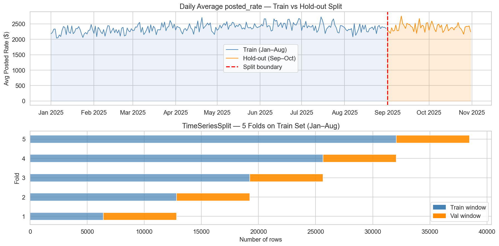

# Phase 5 — Train / Validation Split Strategy Walkthrough

**Project:** Freight Rate Prediction Challenge  
**Notebook:** `freight_rate_prediction.ipynb` (cells 72–84)  
**Input:** X_train (48,000 × 27), y_train = log_rate, X_val (12,000 × 27)  
**Output:** X_tr, y_tr (Jan–Aug), X_hold, y_hold (Sep–Oct), evaluate() function, naive baseline  
**Goal:** Build a robust evaluation setup that mirrors the real-world temporal forecasting task

---

## Overview

| Sub-step | What Was Done |
|---|---|
| 5a | Temporal split — Jan–Aug (train 80%) · Sep–Oct (hold-out 20%) |
| 5b | Visualisation — rate trend with split boundary + CV fold diagram |
| 5c | TimeSeriesSplit(n_splits=5) setup with fold date ranges |
| 5d | Evaluation metric functions: RMSE (log + $), MAE, R², MAPE |
| 5e | Naive baseline ("always predict global mean") |
| 5f | Summary |

---

## 5a — Temporal Split

### The Problem with Random Splits

Freight rates are a time series. A random split would mix rows from January with rows from October in both training and test sets, meaning the model can "peek" at future market conditions while learning past ones. This produces an optimistic validation score that does not generalise to the Nov–Dec hold-out.

> **A model trained on a random split would look good in validation but fail in production.**

### The Chosen Strategy

We mirror the structure of the real task exactly:

```
Jan 2025 ──────────────────────────── Aug 2025 | Sep–Oct 2025 | Nov–Dec 2025
         TRAIN (Jan–Aug, 80%)                    HOLD-OUT (20%)  FINAL VAL
```

The hold-out covers the same 2-month forward-looking window as the true validation gap (the model must predict Nov–Dec without ever seeing those dates during training — Sep–Oct simulates this).

### Code

```python
HOLDOUT_START = pd.Timestamp('2025-09-01')

train_mask   = df_train['date'] < HOLDOUT_START
holdout_mask = df_train['date'] >= HOLDOUT_START

X_tr    = X_train[train_mask].reset_index(drop=True)
y_tr    = y_train[train_mask].reset_index(drop=True)

X_hold  = X_train[holdout_mask].reset_index(drop=True)
y_hold  = y_train[holdout_mask].reset_index(drop=True)
```

### Result

```
Temporal split summary:
  TRAIN (Jan–Aug)    : 38,477 rows   (2025-01-01 → 2025-08-31)
  HOLD-OUT (Sep–Oct) :  9,523 rows   (2025-09-01 → 2025-10-31)
  FINAL VAL (Nov–Dec): 12,000 rows   (no target — submission only)

  Hold-out fraction  : 19.8%
```

The near-exact 80/20 split arises naturally from the monthly distribution of loads (~4,000–5,000 rows/month × 8 months train / 2 months hold-out).

---

## 5b — Visualisation of the Split

### Chart



### Panel 1 — Daily Rate Trend with Split Boundary

- **Blue region**: Training window (Jan–Aug). The model learns from these 38,477 rows.
- **Orange region**: Hold-out window (Sep–Oct). Completely unseen during training; used to evaluate real-world performance.
- **Red dashed line**: The split boundary (Sep 1, 2025).

The chart confirms that rates in the hold-out period follow the same distributional range as training data — there is no dramatic structural break that would make the hold-out unusually easy or hard.

### Panel 2 — TimeSeriesSplit Fold Diagram

Each horizontal bar shows one CV fold:
- **Blue portion**: training sub-window for that fold
- **Orange portion**: validation sub-window (always after the training window)

As fold number increases, the training window grows (walk-forward expanding window). This is the correct approach for time series because it prevents the model from learning "future-to-past" during cross-validation.

---

## 5c — TimeSeriesSplit Cross-Validation Setup

### Why TimeSeriesSplit?

During hyperparameter tuning (Phase 6), we need to evaluate models multiple times without touching the hold-out set. `TimeSeriesSplit(n_splits=5)` provides 5 chronologically ordered folds, each with a training window followed by a validation window.

**Rules enforced:**
- Data is never shuffled
- Each fold's validation window is strictly after its training window
- Fold 5 uses the most data and is closest to the real evaluation scenario

### Code

```python
from sklearn.model_selection import TimeSeriesSplit
tscv = TimeSeriesSplit(n_splits=5)
```

### Fold Date Ranges

```
TimeSeriesSplit fold sizes (on Jan–Aug train set):
  Total rows in training window: 38,477

  Fold 1:  Train 2025-01-01 → 2025-02-10   (6,417 rows)  |  Val 2025-02-10 → 2025-03-23  (6,412 rows)
  Fold 2:  Train 2025-01-01 → 2025-03-23  (12,829 rows)  |  Val 2025-03-23 → 2025-05-01  (6,412 rows)
  Fold 3:  Train 2025-01-01 → 2025-05-01  (19,241 rows)  |  Val 2025-05-01 → 2025-06-11  (6,412 rows)
  Fold 4:  Train 2025-01-01 → 2025-06-11  (25,653 rows)  |  Val 2025-06-11 → 2025-07-21  (6,412 rows)
  Fold 5:  Train 2025-01-01 → 2025-07-21  (32,065 rows)  |  Val 2025-07-21 → 2025-08-31  (6,412 rows)
```

Each validation window covers approximately 6–7 weeks — a realistic forward-looking evaluation horizon.

---

## 5d — Evaluation Metric Functions

### The `evaluate()` Function

A single reusable function computes all five metrics and prints them neatly:

```python
def evaluate(y_true_log, y_pred_log, label=''):
    y_true = np.expm1(y_true_log)   # convert log back to dollars
    y_pred = np.expm1(y_pred_log)

    rmse_log = np.sqrt(mean_squared_error(y_true_log, y_pred_log))
    rmse     = np.sqrt(mean_squared_error(y_true, y_pred))
    mae      = mean_absolute_error(y_true, y_pred)
    r2       = r2_score(y_true, y_pred)
    mape     = np.mean(np.abs((y_true - y_pred) / y_true)) * 100

    print(f'[{label}] RMSE (log scale) : {rmse_log:.4f}')
    print(f'[{label}] RMSE ($)         : ${rmse:,.2f}')
    print(f'[{label}] MAE  ($)         : ${mae:,.2f}')
    print(f'[{label}] R²               : {r2:.4f}')
    print(f'[{label}] MAPE             : {mape:.2f}%')
    return {'rmse_log': rmse_log, 'rmse': rmse, 'mae': mae, 'r2': r2, 'mape': mape}
```

### Metric Reference Table

| Metric | Formula | Unit | Sensitivity | Primary use |
|---|---|---|---|---|
| **RMSE (log)** | √mean((log_pred − log_true)²) | log-$ | Penalises large errors | **Primary training loss** |
| **RMSE ($)** | √mean((pred − true)²) | $ | Penalises outliers | Dollar-scale interpretation |
| **MAE ($)** | mean(|pred − true|) | $ | More robust to outliers | Conservative error estimate |
| **R²** | 1 − SS_res/SS_tot | 0–1 | — | Proportion of variance explained |
| **MAPE** | mean(|pred−true|/true) × 100 | % | Relative error | Business-facing metric |

> **Why we use RMSE on log scale as the primary metric:**  
> Since we model `log(1 + posted_rate)`, RMSE on the log scale is equivalent to penalising relative percentage errors uniformly. A $500 error on a $1,000 rate is weighted the same as a $5,000 error on a $10,000 rate — which is the right behaviour for freight pricing.

---

## 5e — Naive Baseline

### The "Predict the Mean" Benchmark

Before training any model, we establish a naive baseline: **always predict the training mean rate**. Any meaningful model must beat this.

```python
naive_pred_log = np.full(len(y_hold), y_tr.mean())
```

### Result

```
Naive baseline: always predict the training mean log_rate
  Mean log_rate (train): 7.5724  →  $1,942.85

[Naive] RMSE (log scale) : 0.6733
[Naive] RMSE ($)         : $1,590.90
[Naive] MAE  ($)         : $1,152.05
[Naive] R²               : -0.0868
[Naive] MAPE             : 67.42%
```

### Interpretation

| Metric | Naive Value | What It Means |
|---|---|---|
| RMSE ($) | $1,590.90 | On average, predicting the mean is $1,591 off |
| MAE ($) | $1,152.05 | Median-like error is $1,152 off |
| R² | **−0.09** | Negative — worse than a flat line, because hold-out variance is high |
| MAPE | **67.42%** | Off by 67% on average — completely unacceptable for business |

A good model should achieve:
- **RMSE ($) < $400** (75% better than naive)  
- **MAPE < 15%** (business-acceptable accuracy)  
- **R² > 0.90** (explains >90% of rate variance)

---

## 5f — Phase 5 Summary (Printed Output)

```
=================================================================
 Phase 5 — Split Strategy Summary
=================================================================

Temporal split:
  X_tr    (Jan–Aug): 38,477 rows × 27 features
  X_hold  (Sep–Oct):  9,523 rows × 27 features
  X_val   (Nov–Dec): 12,000 rows × 27 features (no target)

Cross-validation: TimeSeriesSplit(n_splits=5) on Jan–Aug window

Evaluation metrics: RMSE (log) · RMSE ($) · MAE ($) · R² · MAPE

Naive baseline RMSE ($): $1,590.90
Naive baseline MAPE    : 67.42%

Setup is ready. Proceeding to Phase 6 — Model Training.
```

---

## Files Produced in Phase 5

| File | Description |
|---|---|
| `eda_5b_split.png` | Rate trend with split boundary + CV fold diagram |
| `freight_rate_prediction.ipynb` | Updated notebook with 13 new Phase 5 cells (cells 72–84) |

---

## Key Design Decisions

| # | Decision | Rationale |
|---|---|---|
| 1 | **Temporal split at Sep 1, 2025** | Creates a 2-month hold-out exactly mirroring the Nov–Dec prediction gap |
| 2 | **Never use random split** | Random split leaks future market conditions and seasonal patterns into training |
| 3 | **Hold-out is completely unseen during training** | Provides an honest estimate of Nov–Dec performance |
| 4 | **TimeSeriesSplit(n_splits=5) for CV** | Respects temporal ordering during hyperparameter tuning; no data shuffling |
| 5 | **Expanding training window per fold** | Each fold uses all available past data — mimics real model retraining cadence |
| 6 | **RMSE (log) as primary metric** | Matches the model's training loss; penalises relative errors uniformly across rate levels |
| 7 | **Naive baseline established** | Sets a minimum bar: any model must beat RMSE=$1,591 and MAPE=67% |

---

## Final State After Phase 5

| Object | Shape / Value | Description |
|---|---|---|
| `X_tr` | (38,477, 27) | Training features — Jan to Aug 2025 |
| `y_tr` | (38,477,) | Training target — log(1 + posted_rate) |
| `X_hold` | (9,523, 27) | Hold-out features — Sep to Oct 2025 |
| `y_hold` | (9,523,) | Hold-out target — log(1 + posted_rate) |
| `X_val` | (12,000, 27) | Final prediction features — Nov to Dec 2025 |
| `tscv` | TimeSeriesSplit(5) | CV splitter object for hyperparameter tuning |
| `evaluate()` | function | Computes RMSE (log+$), MAE, R², MAPE |
| Naive RMSE ($) | $1,590.90 | Baseline to beat |
| Naive MAPE | 67.42% | Baseline to beat |

---

## Next Steps — Phase 6 (Model Training)

With the evaluation framework in place, Phase 6 will train and tune the following models on `(X_tr, y_tr)` and evaluate on `(X_hold, y_hold)`:

1. **Ridge Regression** — linear baseline (uses one-hot features)
2. **XGBoost** — gradient boosting, Optuna hyperparameter search
3. **LightGBM** — fast gradient boosting, Optuna search
4. **CatBoost** — handles categoricals natively, strong out-of-the-box
5. **Ensemble** — weighted average of top models

The best model (or ensemble) will then be used to fill `validation_predictions.csv` and `december-chart-inputs.csv` for submission.
