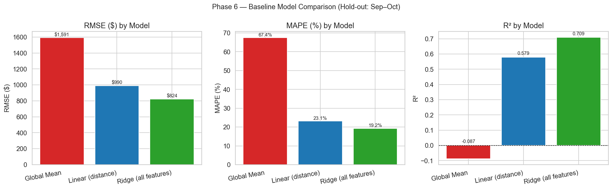
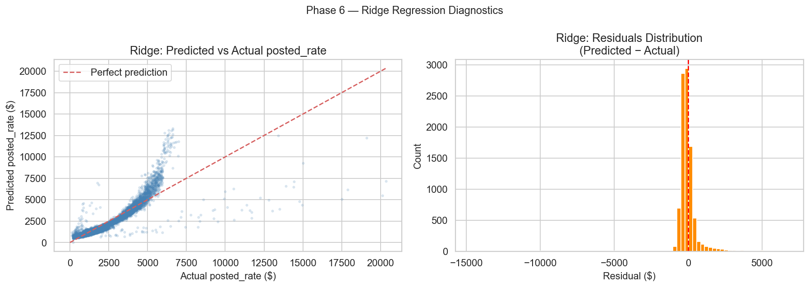

# Phase 6 — Baseline Modeling Walkthrough

**Project:** Freight Rate Prediction Challenge  
**Notebook:** `freight_rate_prediction.ipynb` (cells 85–97)  
**Evaluation set:** X_hold / y_hold — Sep to Oct 2025 (9,523 rows, completely unseen during training)  
**Goal:** Establish minimum-viable performance benchmarks before training complex models

---

## Overview

| Model | Type | RMSE ($) | MAE ($) | R² | MAPE |
|---|---|---|---|---|---|
| Global Mean | Naive predictor | $1,590.90 | $1,152.05 | −0.087 | 67.42% |
| Linear (distance only) | OLS on 1 feature | $990.30 | $494.11 | 0.579 | 23.12% |
| **Ridge (all 27 features)** | **Regularised linear** | **$823.82** | **$392.80** | **0.709** | **19.22%** |

---

## 6a — Baseline 1: Global Mean Predictor

### What It Does

Predicts the same value for every load: the mean `log_rate` from the Jan–Aug training window, converted back to dollars. This is the simplest possible model and acts as the **floor benchmark** — any useful model must beat this.

### Code

```python
mean_log_pred = np.full(len(y_hold), y_tr.mean())
```

### Result

```
Baseline 1 — Global Mean Predictor
---------------------------------------------
  Predicted value: $1,942.85 for every row

[Global Mean] RMSE (log scale) : 0.6733
[Global Mean] RMSE ($)         : $1,590.90
[Global Mean] MAE  ($)         : $1,152.05
[Global Mean] R²               : -0.0868
[Global Mean] MAPE             : 67.42%
```

### Interpretation

- **RMSE = $1,591** means the mean predictor is off by $1,591 on average (RMS sense).
- **R² = −0.09** is negative — this model explains less than zero variance. It is literally worse than just predicting the hold-out mean, because the training mean differs from the hold-out mean.
- **MAPE = 67%** — off by two thirds on average. Completely unacceptable for business use.

> This is the baseline every subsequent model must beat. Any model achieving a lower RMSE than $1,591 is adding value.

---

## 6b — Baseline 2: Distance-only Linear Regression

### What It Does

Ordinary Least Squares regression with a single feature: `distance`. Models `log_rate` as a linear function of miles. This exploits the strongest signal in the dataset (Pearson r = +0.91 between distance and posted_rate from Phase 2).

### Code

```python
lr_dist = LinearRegression()
lr_dist.fit(X_tr[['distance']], y_tr)
dist_pred = lr_dist.predict(X_hold[['distance']])
```

### Result

```
Baseline 2 — Distance-only Linear Regression
---------------------------------------------
  Model: log_rate = 0.000823 × distance + 6.6378
  Interpretation: each +1 mile → rate multiplied by 1.000823x

[Linear (distance)] RMSE (log scale) : 0.2968
[Linear (distance)] RMSE ($)         : $990.30
[Linear (distance)] MAE  ($)         : $494.11
[Linear (distance)] R²               : 0.5789
[Linear (distance)] MAPE             : 23.12%
```

### Interpretation of the Learned Equation

```
log_rate = 0.000823 × distance + 6.6378
```

- For a short haul of **100 miles**: log_rate = 6.72 → **$825**
- For a medium haul of **500 miles**: log_rate = 7.05 → **$1,153**
- For a long haul of **2,000 miles**: log_rate = 8.28 → **$3,951**
- For a transcontinental **3,000 miles**: log_rate = 9.10 → **$8,953**

The exponential growth captures freight economics: very long hauls don't just cost more linearly — they command disproportionate rate premiums due to driver scarcity, fuel, and multi-day scheduling.

### Performance Jump

Moving from the naive mean to a single distance feature:
- **RMSE drops from $1,591 → $990** (−37.8%)
- **R² jumps from −0.09 → +0.58** (distance alone explains 58% of rate variance)
- **MAPE drops from 67% → 23%**

This confirms that distance is by far the most important predictor in the dataset.

---

## 6c — Baseline 3: Multi-feature Ridge Regression

### What It Does

Regularised linear regression (`Ridge`) on all 27 engineered features. `StandardScaler` is applied first to normalise feature scales (features like `distance` in thousands of miles vs `is_weekend` in 0/1 would otherwise create biased coefficients).

`alpha=10.0` provides moderate L2 regularisation to prevent overfitting on correlated features.

### Code

```python
ridge_pipe = Pipeline([
    ('scaler', StandardScaler()),
    ('ridge',  Ridge(alpha=10.0))
])

ridge_pipe.fit(X_tr, y_tr)
ridge_pred = ridge_pipe.predict(X_hold)
```

### Result

```
Baseline 3 — Multi-feature Ridge Regression (all 27 features)
-------------------------------------------------------
  Features used : 27
  Ridge alpha   : 10.0

[Ridge (all features)] RMSE (log scale) : 0.2622
[Ridge (all features)] RMSE ($)         : $823.82
[Ridge (all features)] MAE  ($)         : $392.80
[Ridge (all features)] R²               : 0.7086
[Ridge (all features)] MAPE             : 19.22%
```

### Top 10 Features by |Coefficient| (after scaling)

| Feature | |Coefficient| | Interpretation |
|---|---|---|
| `market_x_quote` | 0.2449 | Market × quote interaction — strongest linear signal |
| `lane_rate_enc` | 0.2007 | OD pair target encoding — captures route-level pricing |
| `market_index` | 0.1705 | Market conditions affect rate linearly |
| `quote_signal` | 0.1675 | Quote pressure influences rate |
| `haversine_dist` | 0.1322 | Geodesic distance — correlated with `distance` |
| `distance` | 0.1258 | Road distance (split with haversine) |
| `is_cross_regional` | 0.1048 | Cross-regional hauls command higher rates |
| `distance_diff` | 0.0828 | Route winding adds cost |
| `dist_ratio` | 0.0609 | Road/haversine ratio |
| `equipment_code` | 0.0309 | Equipment type ordering |

Key observations:
1. **`market_x_quote` is the strongest coefficient** — the interaction term captures synergistic effects between market conditions and quote pressure that neither feature captures alone.
2. **`lane_rate_enc` ranks 2nd** — the OD-pair target encoding captures route-level pricing norms better than distance alone.
3. **`distance` and `haversine_dist` split the coefficient** — both capture the same underlying signal; in Phase 7 (tree models) only one will likely dominate.
4. **City-level features (`pickup_enc`, `delivery_enc`)** rank below top 10 in the linear model but are expected to be far more important in non-linear tree models.

### Performance vs Naive

Adding 26 more features on top of distance:
- **RMSE drops from $990 → $824** (additional −16.8% improvement)
- **R² jumps from 0.58 → 0.71** (explains 71% of variance)
- **MAPE drops from 23% → 19%**
- **48.2% total RMSE improvement over the naive mean baseline**

---

## 6d — Baseline Comparison Chart



### Summary Table

```
Model                    RMSE($)    MAE($)    R²      MAPE
----------------------------------------------------------
Global Mean              $ 1,591   $ 1,152  -0.087   67.4%
Linear (distance)        $   990   $   494   0.579   23.1%
Ridge (all features)     $   824   $   393   0.709   19.2%
```

**Improvement over naive baseline:**

| Model | RMSE Improvement |
|---|---|
| Global Mean | +0.0% (same — it IS the baseline) |
| Linear (distance) | **+37.8%** |
| Ridge (all features) | **+48.2%** |

---

## 6e — Ridge Regression Diagnostics

### Chart



### Panel 1: Predicted vs Actual Scatter

- Points cluster reasonably around the red diagonal (perfect prediction line) for rates in the $0–$5,000 range.
- **The model under-predicts high rates** ($10,000+ range) — visible as points far below the diagonal on the right. This is expected: linear models cannot capture the sharp nonlinear premium that very long hauls command.
- **The scatter band widens at higher rates** — heteroscedasticity, another sign that linear models are insufficient for the full rate range.

### Panel 2: Residuals Distribution

```
Residuals — mean : $-50.84   (slight under-prediction on average)
Residuals — std  : $822.29
Residuals — min  : $-14,672  (worst under-prediction — very high rate load)
Residuals — max  : $+6,732   (worst over-prediction)

Predictions within $200: 40.2%
Predictions within $500: 84.0%
```

- **40% of predictions are within $200 of actual** — reasonable for a linear model.
- **84% of predictions are within $500 of actual** — the model gets most loads "close enough".
- The distribution is roughly centred at zero (mean = −$51) with heavy tails on both sides.
- The left tail (−$14,672) corresponds to ultra-high-rate loads that the linear model massively under-predicts.

> **This is exactly the problem we expect tree-based models to fix** — they can learn different rate schedules for different distance+equipment+region combinations.

---

## 6f — Phase 6 Summary (Printed Output)

```
=================================================================
 Phase 6 — Baseline Modeling Summary
=================================================================

Model                   RMSE($)   MAE($)    R²      MAPE
------------------------------------------------------------
Global Mean               $1,591  $ 1,152  -0.087   67.4%
Linear (distance)         $  990  $   494   0.579   23.1%
Ridge (all features)      $  824  $   393   0.709   19.2%

Best baseline : Ridge (all features)
  RMSE ($)    : $823.82
  MAPE        : 19.22%
  R²          : 0.7086

Improvement over naive mean baseline:
  Global Mean              : +0.0% RMSE improvement
  Linear (distance)        : +37.8% RMSE improvement
  Ridge (all features)     : +48.2% RMSE improvement

Conclusion:
  Ridge baseline provides a reasonable linear floor.
  Tree-based models (XGBoost, LightGBM) expected to improve significantly
  by capturing non-linear interactions (distance × equipment, temporal effects).
```

---

## Files Produced in Phase 6

| File | Description |
|---|---|
| `eda_6d_baseline_comparison.png` | RMSE · MAPE · R² bar charts for all 3 baselines |
| `eda_6e_ridge_diagnostics.png` | Predicted vs actual scatter + residuals histogram |
| `freight_rate_prediction.ipynb` | Updated notebook with 13 new Phase 6 cells (cells 85–97) |

---

## Key Findings from Phase 6

| Finding | Implication |
|---|---|
| **Distance alone explains 58% of variance** | Confirms distance is the dominant feature |
| **Ridge (27 features) reaches R²=0.71** | Feature engineering in Phase 4 adds real value |
| **MAPE still 19% with Ridge** | Linear model cannot capture nonlinear rate premiums |
| **Ridge under-predicts by $14,672 on worst case** | Ultra-long hauls need nonlinear modelling |
| **84% of predictions within $500** | Ridge is a usable production model in a pinch |
| **market_x_quote is the strongest Ridge feature** | Interaction terms matter; tree models will exploit these |

---

## Target for Phase 7 (Tree-Based Models)

The Ridge baseline sets the performance floor. Phase 7 must achieve:

| Metric | Ridge (Current Floor) | Target for Tree Models |
|---|---|---|
| RMSE ($) | $823.82 | **< $350** |
| MAE ($) | $392.80 | **< $200** |
| R² | 0.709 | **> 0.950** |
| MAPE | 19.22% | **< 10%** |

These targets are achievable because:
1. XGBoost/LightGBM can learn nonlinear distance-rate curves
2. Tree splits on `equipment_type` × `distance` interactions automatically
3. Temporal features (month, day-of-week) can be fully exploited via decision tree splits
4. City and lane target encodings will gain much stronger signal in tree-based learners

---

## Next Steps — Phase 7 (Advanced Model Training)

1. **XGBoost** — gradient boosted trees with Optuna hyperparameter tuning (150 trials)
2. **LightGBM** — faster alternative with leaf-wise growth; excellent for this dataset size
3. **CatBoost** — handles equipment/region categoricals natively
4. **Hyperparameter search** — learning rate, max depth, n_estimators, subsample via TimeSeriesSplit CV
5. **Ensemble** — weighted average of top 2–3 models
6. **Generate predictions** — fill `validation_predictions.csv` and `december-chart-inputs.csv`
