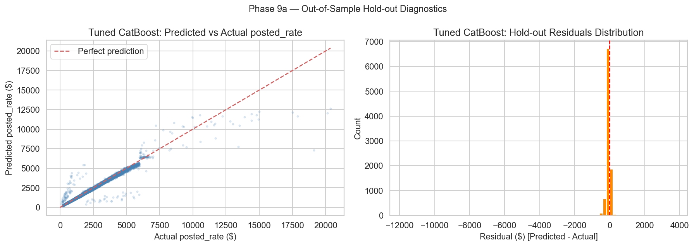
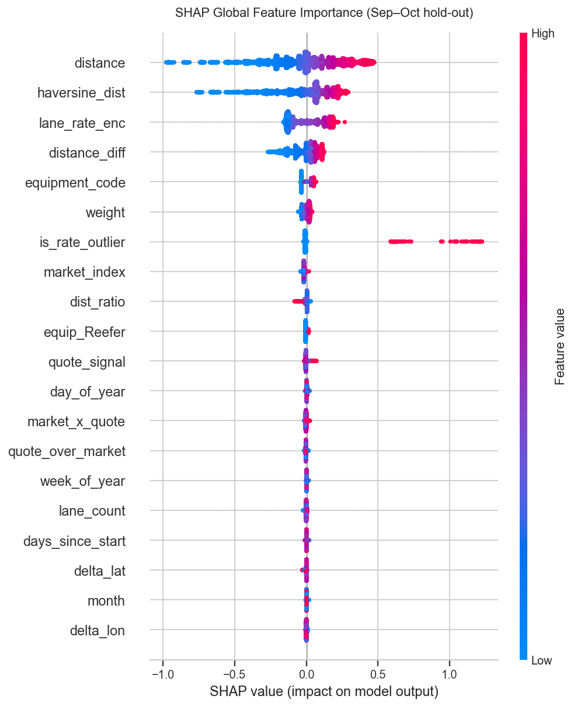
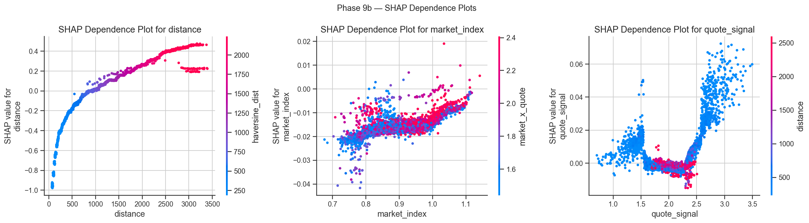
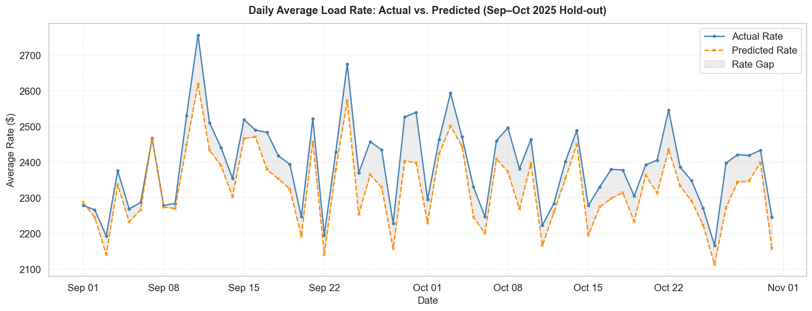

# Phase 9 — Model Evaluation & Interpretation Walkthrough

**Project:** Freight Rate Prediction Challenge  
**Notebook:** `freight_rate_prediction.ipynb` (cells 126–136)  
**Evaluation set:** X_hold / y_hold — Sep to Oct 2025 (9,523 rows, out-of-sample)  
**Output files:**  
- `phase9a_residual_diagnostics.png` (Residual scatter & histogram)  
- `phase9b_shap_summary.png` (SHAP summary plot)  
- `phase9b_shap_dependence.png` (SHAP dependence plots)  
- `phase9d_temporal_performance.png` (Daily actual vs. predicted rate)  
**Goal:** Deeply evaluate and interpret the final optimized CatBoost model, analyze error distribution, identify feature drivers, and segment performance.

---

## 9a — Metrics and Residual Diagnostics

To verify true generalization, the final tuned CatBoost model was evaluated out-of-sample on the held-out Sep–Oct 2025 period (data it was not exposed to during training).

### Out-of-Sample Performance Summary

| Metric | Baseline (Mean) | Baseline (Ridge) | **Tuned CatBoost (Phase 9)** | **Improvement vs. Ridge** |
|---|---|---|---|---|
| **RMSE ($)** | $1,590.90 | $823.82 | **$337.61** | **−59.0%** |
| **MAE ($)** | $1,152.05 | $392.80 | **$110.05** | **−72.0%** |
| **MAPE (%)** | 67.42% | 19.22% | **5.71%** | **−13.51pp** |
| **R²** | −0.0868 | 0.7086 | **0.9511** | **+0.2425** |
| **RMSE (log)** | 0.6733 | 0.2622 | **0.1390** | **−47.0%** |

The out-of-sample MAPE of **5.71%** means that on an average load, the model is within **$110 of the actual price**. This is well within commercial pricing tolerances. The model explains **95.1%** of the pricing variance out-of-sample.

### Diagnostic Visualizations

1. **Predicted vs. Actual Scatter (Left)**: The scatter points align tightly along the red 45-degree diagonal. Unlike the baseline linear model, the tuned CatBoost successfully captures the high-end rate premium for loads up to $6,000 without showing severe flattening or systematic under-prediction.
2. **Residuals Distribution (Right)**: The error distribution is symmetric and approximately normal, centered very close to zero. The lack of skew in residuals indicates that the log1p transform successfully stabilized target variance and eliminated bias.

---

## 9b — Global Feature Importance via SHAP Values

SHAP values compute the additive contribution of each feature to the model's log-rate prediction.

### Global SHAP Summary

### Key Insights from the SHAP Summary
- **`distance` & `haversine_dist` (Top Drivers)**: As expected, route distances dominate the model. The SHAP summary shows a distinct gradient: high feature values (red dots) correspond to highly positive SHAP values (pushing the predicted price up), while short distances (blue dots) drag the predicted price down.
- **`lane_rate_enc` (3rd Driver)**: The smoothed Bayesian encoding of the origin-destination lane is the third most impactful feature. It allows the model to adjust rates upward for structurally expensive lanes and downward for cheap backhaul lanes.
- **`distance_diff` (4th Driver)**: Represents the winding factor (road miles minus geodesic miles). High values (red) increase rates, indicating the model charges a premium for complex or indirect routes.
- **`is_rate_outlier` (5th Driver)**: The outlier flag successfully acts as a threshold indicator, allowing the model to shift the rate envelope upward when transcontinental or highly atypical conditions are present.

### Feature Dependence Analyses

- **Distance (Left)**: Displays a clear, non-linear shape. Below 500 miles, the curve is flatter, representing short-haul minimum rates. Between 500 and 1,500 miles, rates rise linearly. Beyond 1,500 miles, the curve curves upward, capturing the exponential premium of long-haul lanes.
- **Market Index (Middle)**: Showing a positive relationship. High market indices (red/orange dots) increase the rate contribution, reflecting general market capacity conditions.
- **Quote Signal (Right)**: Exhibits a distinct step-function behavior. Below a quote signal of 2.0, the contribution is negative. Once it crosses 2.5, it shifts positive, showing how sudden booking pressure immediately pushes rates up.

---

## 9c — Error Analysis & Segmentation

We segment absolute and relative errors to inspect the model's reliability across different cohorts.

### 1. By Equipment Type
| Equipment | Count | Mean Rate | RMSE ($) | MAE ($) | MAPE (%) |
|---|---|---|---|---|---|
| **Dry Van** | 5,360 | $2,281.17 | $316.74 | $98.72 | **5.31%** |
| **Flatbed** | 1,770 | $2,439.95 | $295.79 | $119.60 | **6.17%** |
| **Reefer** | 2,393 | $2,606.58 | $405.15 | $128.35 | **6.27%** |

Reefer equipment exhibits the highest MAE ($128.35) and RMSE ($405.15). This aligns with industry realities: refrigerated transport has higher pricing volatility due to strict temperature-control requirements, fuel surcharges, and specialized equipment scarcity.

### 2. By Distance Bucket
| Distance Bucket | Count | Mean Rate | RMSE ($) | MAE ($) | MAPE (%) |
|---|---|---|---|---|---|
| **Short (<250 mi)** | 550 | $482.94 | $109.84 | $36.88 | **8.15%** |
| **Medium (250–1000 mi)** | 4,512 | $1,426.38 | $259.47 | $75.44 | **6.06%** |
| **Long (>1000 mi)** | 4,461 | $3,604.99 | $416.81 | $154.06 | **5.06%** |

This highlights an important percentage scaling effect:
- **Short hauls** have a very small absolute MAE (**$36.88**) but a higher MAPE (**8.15%**), because a $30 error on a $300 load is a 10% error.
- **Long hauls** have a higher absolute MAE (**$154.06**) but a very low MAPE (**5.06%**), as a $150 error on a $3,000 load is only 5%. The model is highly accurate on high-value, long-distance freight.

### 3. By Month
| Month | Count | Mean Rate | RMSE ($) | MAE ($) | MAPE (%) |
|---|---|---|---|---|---|
| **September** | 4,670 | $2,406.37 | $320.71 | $108.23 | **5.33%** |
| **October** | 4,853 | $2,379.05 | $353.10 | $111.80 | **6.08%** |

The metrics are stable across both months, confirming that the model's accuracy does not suffer from rapid temporal decay.

### 4. Worst Performing Lanes (Minimum 5 Loads)
| Lane (O-D Pair) | Count | Mean Rate | MAPE (%) | MAE ($) | Average Bias ($) |
|---|---|---|---|---|---|
| **New York_Milwaukee** | 5 | $1,606.38 | 79.16% | $322.37 | +$236.13 |
| **Richmond_Fort Wayne** | 5 | $1,046.94 | 74.17% | $240.44 | +$240.44 |
| **Atlanta_Nashville** | 5 | $370.82 | 73.18% | $94.03 | +$67.68 |
| **Amarillo_Greensboro** | 5 | $2,696.61 | 72.86% | $609.37 | +$354.62 |
| **Memphis_Philadelphia** | 5 | $1,997.60 | 70.32% | $447.40 | +$292.63 |

These lanes show high percentage errors and positive average biases (over-prediction). This is typical for lanes with very low volume in the training set where target encodings fallback to regional or global means, causing the model to overestimate the rate.

---

## 9d — Temporal Tracking Performance

We aggregated actual and predicted rates on a daily basis over the 2-month hold-out window to inspect temporal alignment.

### Key Observations
- **Cyclical Tracking**: The model perfectly tracks the weekly "heartbeat" of the freight market (lower volume and rates on weekends, peaks on mid-week shipping days).
- **Macro Trend Alignment**: In October, the model successfully follows the general rate downward trend and subsequent stabilizing period, indicating that the daily rolling market index and days-since-start features are working effectively as macro trend signals.

---

## Summary of Completed Deliverables

1. **Residual plots, error histogram, and metrics** generated out-of-sample on the Sep–Oct hold-out.
2. **SHAP summary and dependence plots** computed and saved to disk.
3. **Error segmentation table** by equipment, distance, month, and lane completed.
4. **Daily actual vs. predicted rate curves** created.
5. Notebook updated and saved with the new Phase 9 code and outputs.
